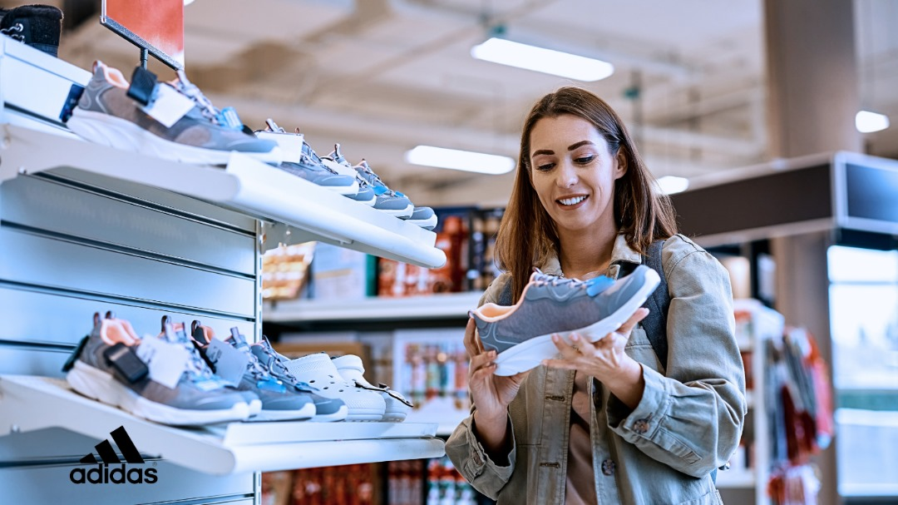
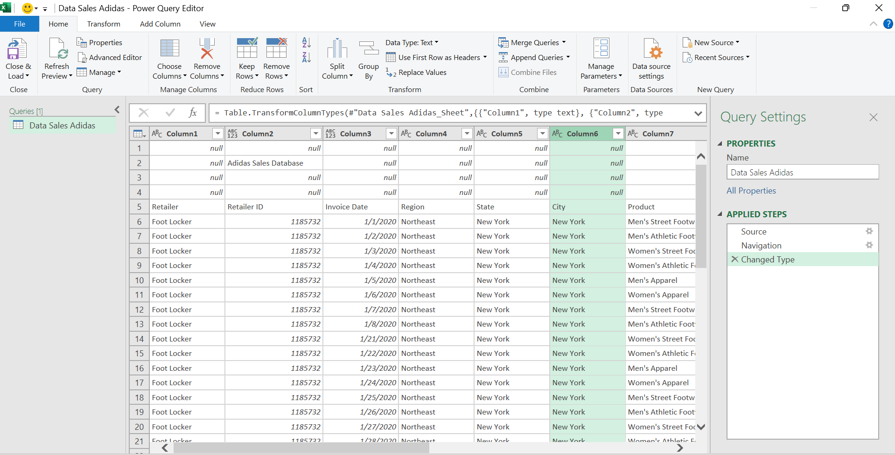
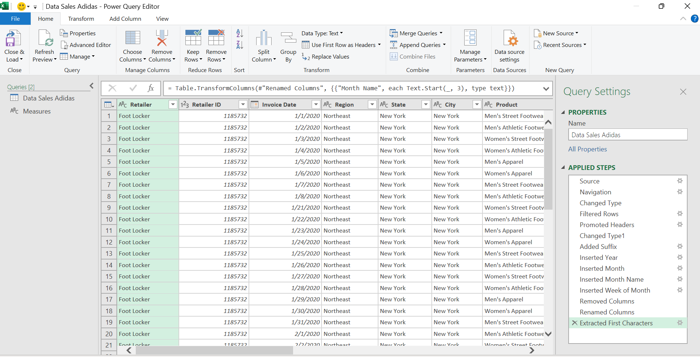
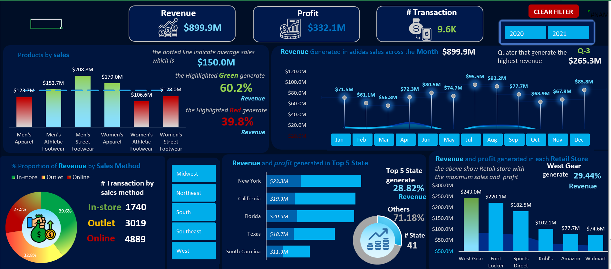

# Adidas Sales Analysis

## Project Review
---

This Adidas sales analysis project aim to provide visualized insight and analysis of Adidas sales in the United State across several state in different regions. it analyze top selling footwares, it outline in porportion of sales by method it also provide financial information about the product allocated retail store.

### Data Source
Adidas store dataset -> the data set used in this analysis and visualization is "adidas sale.csv" file, this contain financial information of sales in different state

### Problem Statement
- Which top 3 FootWare Product generate the highest Sales
- What is the revenue generated in the Top 5 State 
- What is the Highest % Porportion of revenue in Sales Method and which method is known to have more transaction
- Which Retail Store generate the Highest Total Revenue
- What is the Revenue generated by Quaters and the flow increase of its generation across Years and Regions
- What is the Total Revenue, Profit Generated in Adidas Sales and what is the flow increase in Years

### Tool / Skills Demonstrated

#### Tool
- Excel

#### Skills Demonstrated
- Power Query
- If and Nested If Funtion
- Index and Match / Lookup
- Sum / Max Funtion
- Clear Filter Button using Macro
- Visualization

### Data cleaning (Power Query)

The steps used to clean the dataset in preparation for Analysis and Visualization

- Filter Null Values (_Note_ _this has no effect on the data_)
- Promoted Header
- Change text type
- Extracted characters for analysis
  
 Before Data Cleaning                                 |                 After Data Cleaning
 :---------------------------------------------------:|:---------------------------------------:
    | 

### Data Analysis / Findings

- **Men's Athletic FootWare**, **Men's Street FootWare** and **Women's Apparel** are the Top 3 Product that generated the Highest Revenue out of the 6 Product, having a revenue of over **57%**.
- The top 5 State generated over **24%** Revenue with a decrease in sales in the fourth Quater of 2021.
- In total of **9.6K** Transaction, **Online Sales Method** have the highest orders of **4881** Transaction but despite its highest transaction, **Instore** generated the highest Revenue of **39.63%** out of the three Sales Method. 
- **West Retail Store** generated the Highest total Revenue of **29.44%** out of the six Retail Store.
- **Q-3** generated the highest revenue of **$55.3M** in the previous year with a massive increase of **$210.0M** in the next year and still remained the highest Revenue Generating Qauter in Regions Except *NorthEast* and *SouthEast*.
- Adidas Sales generated a Total Revenue of **$889.9M** in all Transactions with a major massive increased revenue of **$717.8M** in **2021**, which is 79.8% of total Revenue in Adidas Sales.
- Also, Adidas sales generated a Total Profit of **$332.1M** in all Transaction having major profit generated in **2021** a total of **$268.8M**, which is 80.1% of total Profit in Adidas Sales.

 

**You Can interact with the project here**
- 
